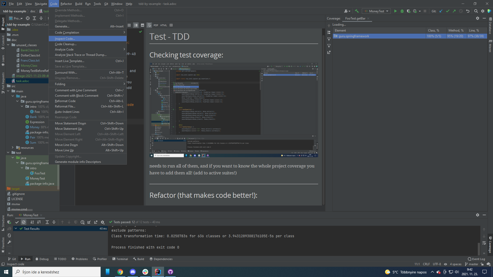

= Test - TDD

== Checking test coverage:

needs to run all of them, and if you want to know the whole project coverage you have to add them all! (add to active suites!)

== Refactor (that makes code better!):

make the whole project!

